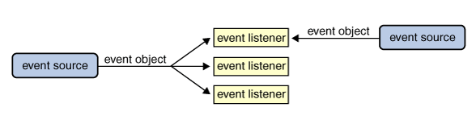

#Classes and Interfaces
##Inheritance##
* Inheritance is a mechanism in which one object acquires all/ some of the properties and behaviours of **parent** object.
* Object - oriented programming allows classes to _inherit_ commonly used state and behaviour from other classes.
* In Java, each class is allowed to to have one direct `super` class,\
  and each `super` class has the potential for an unlimited number of subclasses.


* Inheritance represents `is - a` relationship.
* The keyword `extends` is used to inherit properties from the existing class to a new class.
* The class from which the properties are inherited is called `super class`.
* The class which inherits its properties is called `sub class`.

##super keyword
* Uses
    - `super` is used to refer immediate `Super` class instance variable.
    - super is used to invoke immediate `Super` class method.
    - `super()` is used to invoke immediate `Super` class constructor.
* If a method overrides the `Super` class's methods, \
  we can invoke the overriden method through the use of `super` keyword.

$~$

```java
public class Superclass {
    public void printMethod() {
        System.out.println("Printed in Superclass.");
    }
}

public class Subclass extends Superclass {
    @Override
    public void printMethod() {
        super.printMethod();
        System.out.println("Printed in Subclass.");
    }

    public static void main(String[] args) {
        Subclass s = new Subclass();
        s.printMethod();
    }
}
```
$~$

Compiling and executing the following Subclass prints the following output:

```
Printed in Superclass.
Printed in Subclass.
```

* If a constructor does not explicitly invoke a superclass constructor,\ 
  the Java compiler automatically inserts a call to the no-argument constructor of
  the super class.
* If the superclass does not have a no-argument constructor, you will get a \
  compile time error.
* `Object` *does* have such a constructor, so if `Object` is the only superclass\
  there is no problem.
* If a subclass constructor invokes a superclass constructor, either implicitly or
  explicitly, there will a whole chain of constructors called, all the way \
  back to the constructor of `Object`. This is called **constructor** **chaining**

##Interfaces
* Interfaces declares collection of **abstract** methods *that must be implemented by the implementing class*
* Implementing class must define all the methods declared in the **Interface** or else the class must be declared as abstract.
* Variables declared in as interfaces are ```public``` , ```static``` , and ```final``` by default.

****


## Anonymous Inner Classes
Anonymous inner classes combines the process of defining an inner class and creating an
object of inner class into one step. it is a class without any name *anonymous*

* They can't have constructors (*no* *name*)
* No ```extends``` or ```implements``` keyword is required.
* The Name given after `new` is taken as ```class``` or ```interface```.

----

##HashMap class
**syntax** for the HashMap invocation is:
``` java
HashMap<E> h = new HashMap<E>();
```

----

##Stack class
```java
public class Stack<E> extends Vector<E>
```

Stack is a subclass of `Vector` that implements a standard last-in, first-out stack.
stack only defines the default constructor, which creates an empty stack. Stack
includes all the methods defined by `Vector`, and add several of its own.

$~$

`stack()`<hr>
When a stack is first created, it contains no items

$~$

Apart from the methods inherited from its parent class `Vector`, Stack defines the following methods - <br>

1. `boolean empty()`<hr>Tests if this stack is empty.<hr>Returns true if the stack is empty, and returns false if the stack contains elements
2. `Object peek()`<hr>Returns the element on the top of the stack, but does not remove it.
3. `Object pop()`<hr>Returns the element on the top of the stack, removing it in the process.
4. `Object push(Object element)`<hr>Pushes the element onto the stack. Element is also returned.
5. `int search(Object element)`<hr>Searches for element in the stack.<hr>If found, its offset from the top of the stack is returned.<hr>Otherwise, 1 is returned.

$~$

$~$

**syntax** for implementation of stack

```java
Stack st = new Stack();

try {
    System.out.println(st);
}catch (EmptyStackException e) {
    System.out.println("Empty stack");
}
```

$~$

A more complete and consistent set of **LIFO** stack operations is provided by the *Deque* interface and its implementation

$~$

`Deque<Integer> stack = new ArrayDeque<Integer>();`

Methods to ponder:<hr>
`push()` has the exactly the same effect as `Vector.addElement()`


----


##HashSet
```java
public class HashSet<E> extends AbstractSet<E> implements Set<E>
, Cloneable, Serializable
```
$~$
* Note that this implementation is not synchronized.

* If multiple threads access a hash set concurrently, and at least one of the threads modifies the set, it *must* be `synchronized`

* It should be noted that a Set has no duplicate elements

This class is a member of the **Java Collections Framework**

$~$

$~$

**Syntax** for the implementation

```java
HashSet<String> set = new HashSet<String>();
set.add("jon");
```

$~$

-----

##Comparator Interface

```java
public interface Comparator<T>
```

* This interface is found in `java.util` package

* A comparison function, which imposes a *total* ordering on some collection of objects.

* Comparators can be passed to a sort method `Collections.sort()` or `Arrays.sort()`
to allow precise control over the sort order.

* Comparators can also be used to control the order of certain data structures\
viz sorted sets or sorted maps, or
to provide an ordering for collections of objects that don't have a natural ordering.

####Methods
* `compare(T o1, T o2)` compares its two args for order
* `equals(Object obj)` indicates whether some other object is *equal to* this comparator.


####Example
$~$
```java
import java.util.*;
class NameComparator implements Comparator {
    public int compare(Object o1, Object o2) {
        Student s1 = (Student) o1;
        Student s2 = (Student) o2;

        return s1.name.compareTo(s2.name);
    }
}
```
$~$

In the implementation we use\
`Collections.sort(arrayList, new NameComparator());`

* The `Comparator` implementation is further simplified by using lambda expressions (refer `LambdaExpressions` chapter)

----


##Event Handling
Event handling is the mechanism which controls the events and decides what should happen if an event occurs. This mechanism has the code which is known as `Event Handler` and that gets executed when an event occurs. Java uses the `Delegation Event Model` to handle the events. This model defines the standard mechanism to generate and handle the events.

* Any program that uses GUI (graphical user interface) such as Java application written for windows is event driven.\
* Event describes the change of state of any object.\
* **Example**: Pressing a button, Entering a character in Textbox

####Reacting to an Event
* When an event is detected, a method is invoked. The invoked method is called `Call-Back Method`.\
* This Style of programming is called EventDriven Programming.

####Handling events
* A source generates an Event and send it to one or more listeners registered with the source.\
* Once event is received by the listener, they process the event and then return.\
* Events are supported by a number of java packages\
`java.util`, `java.awt`,`java.awt.event`.

$~$

The Event handling involves four types of classes:\

1. `Event Sources.`\
2. `Event Classes.`\
3. `Event Listeners.`\
2. `Event Adapters.`\


####Example of Event Handling
$~$
```java
import java.awt.*;
import java.awt.event.*;
class MyButtons extends Frame implements ActionListener {
    MyButtons() {
        Button b1 = new Button("Red");
        Button b2 = new Button("Green");
        Button b3 = new Button("Blue");
        setLayout(new FlowLayout());
        add(b1);
        add(b2);
        add(b3);
        b1.addActionListener(this);
        b2.addActionListener(this);
        b3.addActionListener(this);
    }

    public void actionPerformed(ActionEvent ae) {
        String st = ae.ActionCommand();
        if(str.equals("Red")) {
            setBackground(Color.red);
        }
        if(str.equals("Green")) {
            setBackground(Color.green);
        }
        if(str.equals("Blue")) {
            setBackground(Color.blue);
        }
    }

    public static void main(String[] args) {
        MyButtons mb = new MyButtons();
        mb.setSize(500, 400);
        mb.setTitle("My Buttons");
        mb.show();
        mb.addWindowListener(new MyClass());
    }
}

class MyClass extends WindowAdapter {
    public void windowClosing(WindowEvent we) {
        System.exit(0);
    }
}

```

####Java Event Classes and Listener Interfaces

|Event Classes       |Listener Interfaces                               |
|--------------------|:-------------------------------------------------|
|`ActionEvent`       |`ActionListener`                                  |
|`MouseEvent`        |`MouseListener` and `MouseMotionListener`         |
|`MouseWheelEvent`   |`MouseWheelListener`                              |
|`KeyEvent`          |`KeyListener`                                     |
|`ItemEvent`         |`ItemListener`                                    |
|`TextEvent`         |`TextListener`                                    |
|`AdjustmentEvent`   |`AdjustmentListener`                              |
|`WindowEvent`       |`WindowListener`                                  |
|`ComponentEvent`    |`ComponentListener`                               |
|`ContainerEvent`    |`ContainerListener`                               |
|`FocusEvent`        |`FocusListener`                                   |


####Steps to perform Event Handling. \

* Register the component with the Listener.\

For registering the component with Listener, many classes provide the registration methods.\ 



#####For Example:\

* Button\
     `public void addActionListener(ActionListener a){}`\

* MenuItem\
     `public void addActionListener(ActionListener a){}`\

* TextField\
     `public void addActionListener(ActionListener a){}`\
     `public void addTextListener(TextListener a){}`\

* TextArea\
     `public void addTextListener(TextListener a){}`\

* Checkbox\
     `public void addItemListener(ItemListener a){}`\

* Choice\
     `public void addItemListener(ItemListener a){}`\

* List\
     `public void addActionListener(ActionListener a){}`\
     `public void addItemListener(ItemListener a){}`\


####Event Handling Codes.\

We can put event handling code into one of the following places:\

1. Same Class\
2. Other Class\
3. Anonymous Class\

-----

###Factory methods

Factory methods are static methods that return an instance of the native class.

Factory methods:
* have names, unlike constructors, which can clarify code
* do not need to create a new object upon each invocation - objects can be cached and reused, if necessary.
* can return a subtype of their return type - in particular, can _return an object whose implementation class is unknown to the caller_.
* This is a very valuable and widely used feature in many frameworks which use interfaces as the return type of static methods.

```java
public final class ComplexNumber {
    /**
    * static factory method returns an object of this class.
    */
    public static ComplexNumber valueOf(float aReal, float aImaginary) {
        return new ComplexNumber(aReal, aImaginary);
    }

    /**
    * Caller cannot see this private constructor.
    *
    *
    * The only way to build a ComplexNumber is by calling the static factory method.
    */
    private ComplexNumber(float aReal, float aImaginary) {
        fReal = aReal;
        fImaginary = aImaginary;
    }

    private float fReal;
    private float fImaginary;

}
```

Another Example

```java
public class Coordinate {
    private double x_coord;
    private double y_coord;

    private Coordinate(double x, double y) {
        x_coord = x;
        y_coord = y;
    }

    public static final Coordinate fromXY(double x, double y) {
    return new Coordinate(x, y);
    }

    public static final Coordinate fromPolar(double dist, double angle) {
        return new Coordinate(dist * Math.cos(angle), dist * Math.sin(angle));
    }
}
```

----

##Builder Patterns in java

